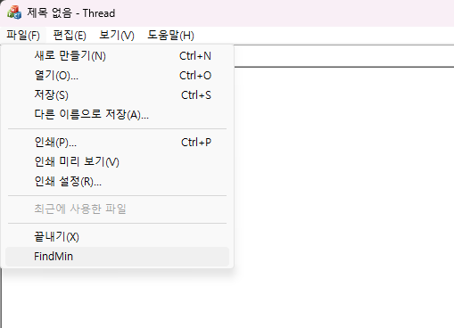
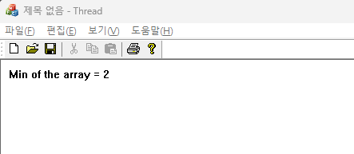
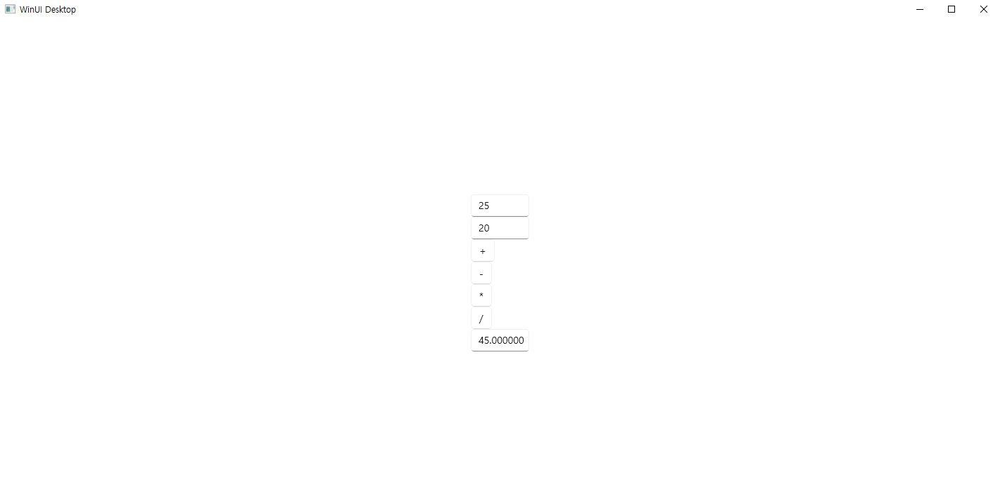
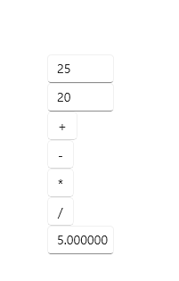
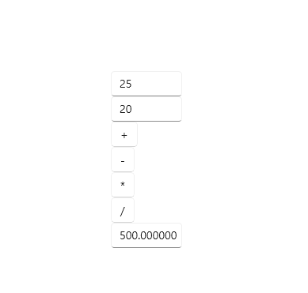
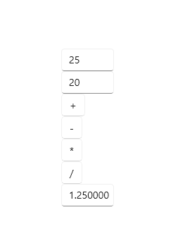

# 231106</br>

비주얼프로그래밍 팀프로젝트 </br>

 컴퓨터공학과 양용석, 권윤호, 김병현</br>

1. MFC의 멀티쓰레드 구현 : 10개의 정수 배열을 받아 최솟값 표시 </br>

코드
```
//CThreadView.h 구조체 정의 및 OnFindMin 함수 정의
struct SData
{
	int array[10] = { 11,3,2,6,7,4,8,10,9,5 };
	int min = 1;
	HWND NotifyWindow;
};
public:
	afx_msg void OnFindmin();
	SData data;
	CWinThread* Thread;
	LRESULT OnMinFound(WPARAM wParam, LPARAM lParam);
```
```
//CThreadView.cpp
BEGIN_MESSAGE_MAP(CThreadView, CView)
	// 표준 인쇄 명령입니다.
	ON_COMMAND(ID_FILE_PRINT, &CView::OnFilePrint)
	ON_COMMAND(ID_FILE_PRINT_DIRECT, &CView::OnFilePrint)
	ON_COMMAND(ID_FILE_PRINT_PREVIEW, &CView::OnFilePrintPreview)
	ON_COMMAND(ID_FINDMIN, &CThreadView::OnFindmin)
	ON_MESSAGE(WM_MIN, &CThreadView::OnMinFound)
END_MESSAGE_MAP()
// CThreadView 그리기

void CThreadView::OnDraw(CDC* pDC)
{
	CThreadDoc* pDoc = GetDocument();
	ASSERT_VALID(pDoc);
	if (!pDoc)
		return;
	pDC->TextOut(10, 10, pDoc->str);
	
}
//스레드 생성 , 포인터 설정
UINT MyThread(LPVOID pParam);
UINT MyThread(LPVOID pParam) {
	SData* pData = (SData*)pParam;
	int min = pData->array[0];
	for (int i = 1; i < 10; i++) {
		if (pData->array[i] < min) {
			min = pData->array[i];
		}
	}
	//메시지 출력
	pData->min = min;

	::PostMessage(pData->NotifyWindow, WM_MIN, 0, 0);
	return 0;

//초기 최소값 설정
void CThreadView::OnFindmin()
{
	data.min = 1;
	data.NotifyWindow = m_hWnd;
	AfxBeginThread(MyThread, &data);
}
//최소값 찾기 후 출력
LRESULT CThreadView::OnMinFound(WPARAM wParam, LPARAM lParam)
{
	CThreadDoc* pDoc = GetDocument();
	ASSERT_VALID(pDoc);
	CString msg;
	msg.Format(L"Min of the array = %d", data.min);
	pDoc->str = msg;
	Invalidate();
	return 0L;
}
```

2. WinUI3 계산기 구현</br>

코드
```
//MainWindow.xaml
 <StackPanel Orientation="Vertical" HorizontalAlignment="Center" VerticalAlignment="Center">
     <TextBox x:Name="va"/>
     <TextBox x:Name="vb"/>
     <Button x:Name="myButton" Click="myButton_Click">+</Button>
     <Button x:Name="myButton1" Click="myButton_Click1">-</Button>
     <Button x:Name="myButton2" Click="myButton_Click2">*</Button>
     <Button x:Name="myButton3" Click="myButton_Click3">/</Button>
     <TextBox x:Name="vc"/>
 </StackPanel>
```

```
//MainWindow.xaml.cpp
 void MainWindow::myButton_Click(IInspectable const&, RoutedEventArgs const&) {
     double a, b, c;
     a = std::stod(va().Text().c_str());
     b = std::stod(vb().Text().c_str());
     c = a + b; vc().Text(std::to_wstring(c));
 }

 void MainWindow::myButton_Click1(IInspectable const&, RoutedEventArgs const&) {
     double a, b, c;
     a = std::stod(va().Text().c_str());
     b = std::stod(vb().Text().c_str());
     c = a - b; vc().Text(std::to_wstring(c));
 }

 void MainWindow::myButton_Click2(IInspectable const&, RoutedEventArgs const&) {
     double a, b, c;
     a = std::stod(va().Text().c_str());
     b = std::stod(vb().Text().c_str());
     c = a * b; vc().Text(std::to_wstring(c));
 }

 void MainWindow::myButton_Click3(IInspectable const&, RoutedEventArgs const&) {
     double a, b, c;
     a = std::stod(va().Text().c_str());
     b = std::stod(vb().Text().c_str());
     c = a / b; vc().Text(std::to_wstring(c));
 }
```

```
//MainWindow.xaml.h
 void myButton_Click(Windows::Foundation::IInspectable const& sender, Microsoft::UI::Xaml::RoutedEventArgs const& args);
 void myButton_Click1(Windows::Foundation::IInspectable const& sender, Microsoft::UI::Xaml::RoutedEventArgs const& args);
 void myButton_Click2(Windows::Foundation::IInspectable const& sender, Microsoft::UI::Xaml::RoutedEventArgs const& args);
 void myButton_Click3(Windows::Foundation::IInspectable const& sender, Microsoft::UI::Xaml::RoutedEventArgs const& args);
```
실행 화면</br>
</br>
</br>
1. 멀티쓰레드 구현 </br>
</br></br>
</br></br>
</br>
</br>
2. WINUI3 계산기 구현</br></br>
</br>
</br>
</br>
</br>
